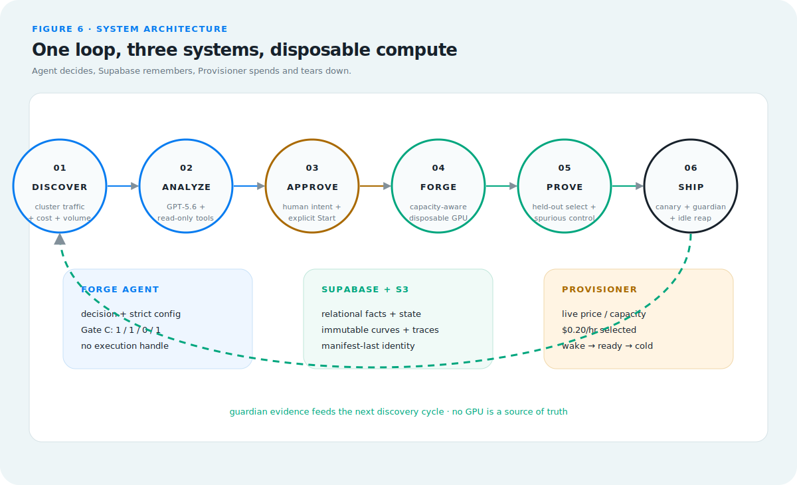

<p align="center">
  
</p>

<p align="center"><strong>Cut the cost of repetitive AI work with small models that are trained, checked, and deployed automatically.</strong></p>

<p align="center">
  
  
  
</p>

# VerifierForge

Businesses often pay a large-model API to solve the same simple task thousands
of times, then pay people to inspect the output. VerifierForge targets the
workflows where that review can be written as a program. It finds the expensive
repetition and—after human approval—automatically trains, validates, and
deploys a smaller model to take over the work. The result is a repeatable path
from an expensive AI workflow to a cheaper specialist model, with evidence at
every handoff and a switch back to the original model.

The current end-to-end proof is deliberately focused: an enterprise data team
uses an AI assistant for 95,000 recurring NL→SQL requests per month at a
modeled cost of $5,500. VerifierForge discovers that workload, recommends a
forge, trains on 50 examples, selects the best checkpoint on 60 unseen
questions, and serves the result behind a reversible canary. It is one proven
business workflow, not a claim that every task should use a small model.

## Reviewer guide — no local setup required

Reviewers do **not** need to clone this repository, install Python, or run a
GPU. Use the invitation code supplied with the DevPost submission:

1. Open **[verifierforge-web.vercel.app](https://verifierforge-web.vercel.app)**.
2. Enter the separately shared reviewer invitation code. It is kept only in
   browser session storage and is never embedded in this repository or URL.
3. Follow the enforced product journey: **Discover → Forge → Runs → Proof →
   Ship**. Each stage unlocks only after its required evidence or approval.
4. In Ship, the report, curves, held-out arena, and browser SQL runner work
   while tuned inference is cold. To try the real tuned model, confirm **Wake
   model**, watch `provisioning → loading → ready`, then run a tuned SQL query.
5. Click **Leave session** when finished. VerifierForge confirms provider
   deletion and a durable `cold` state before clearing the session.

Vercel is the product website. It calls the Railway API/control plane at
`https://verifierforge-production.up.railway.app`; reviewers do not need to
open Railway separately. `Approve & Forge` records human intent, while the
public reviewer's training-side `Start Forge` remains disabled to prevent an
accidental paid training job. Serving Wake is separately protected by the
invitation, an explicit confirmation, one-session concurrency, and a budget
cap. The public [Technical Deep Dive](https://verifierforge-web.vercel.app/tech)
requires no invitation.

## Technical Deep Dive

The full engineering account is available as a public, invitation-free
[visual article](https://verifierforge-web.vercel.app/tech) and as the
[versioned Markdown source](docs/blog/technical-deep-dive.md). It covers:

- the executable NL→SQL verifier, GRPO group-relative update, and gate A;
- the M3 quality run versus its deliberately imperfect random-reward
  falsification reference;
- eight-checkpoint held-out selection and why step 350 shipped;
- the strict-schema Forge Agent and Gate C evaluator; and
- disposable S3 workers, Supabase facts, capacity-aware provisioning, and
  scale-to-zero serving—with limitations kept beside the numbers.

## What is proved in this repository

The committed demo artifacts preserve the completed NL→SQL D4 result without
shipping model weights:

| Measurement | Before | Selected step-350 after |
| --- | ---: | ---: |
| Held-out pass@1 (60 rows) | 0.5833 | 0.7833 |
| Held-out pass@8 | 0.7667 | 0.9000 |
| Mixed fraction | 0.4667 | 0.4333 |

The 0.5B random-reward control curve is included beside the main curve. It is a
falsification reference, not proof that one training run establishes a general
causal claim.

Other completed gates are equally explicit:

| Layer | Current evidence |
| --- | --- |
| Forge Agent | Live 12-scenario Gate C on `gpt-5.6-luna`: decision `1.0`, chain `1.0`, illegal actions `0`, config legality `1.0`; feature flag remains off by default. |
| Product decision | A source-less production Analyze returned `need_more_data`; after a human-approved 50-row source, a fresh run returned `forge` at confidence `0.98` and created an approval in Supabase. |
| Database | SQLite remains local default; the same async SQLAlchemy repositories and Alembic schema passed a real Supabase Postgres migration, reconciliation, and product smoke. |
| Delivery | The reviewer API/proxy is a fixed Railway control plane; tuned GPU inference is now scale-to-zero. The frozen frontend boundary covers 23 operations, including tuned-only completion and explicit Leave-to-cold boundaries that cannot mutate canary routing or silently report deletion. Generated SQL can then run live in an ephemeral browser SQLite/WASM database against the frozen fixture—no canned rows, backend execution, GPU, or second model call. Two RunPod wake cycles reached ready in 282.14s and 266.68s, served real traffic, then idled to provider-inventory zero. The live 200-request proof split 111 default / 89 tuned with no fallback and Guardian `0.95`. |
| Provisioning | P-1 mock lifecycle/fuses pass. P-2 executed an approved 0.5B/100-step S3 run and deleted the pod. P-4 then proved the separate web approval → explicit Start Forge → real RunPod readiness → delete wiring. Before every allocation, RunPod live capacity is queried, approved offers are price-ranked with bounded fallback, and the chosen GPU/rate is audited; the live proof selected RTX 4000 Ada at `$0.20/hr` and deleted it immediately. |

## Architecture

<p align="center">
  
</p>

*The Agent decides, Supabase remembers, and the Provisioner rents and returns
compute. No GPU node is a source of truth.*

The product is one six-step business loop supported by three systems:

1. **Forge Agent** reads traffic, approved samples, economics, and
   verifiability. It can recommend `forge`, `skip`, or `need_more_data`, but it
   has no provider credential or provisioning handle.
2. **Supabase + S3** preserve the truth across disposable machines. Supabase
   stores relational facts and state; S3 stores immutable traces, checkpoints,
   curves, and evidence manifests.
3. **Provisioner** crosses the spending boundary only after explicit human
   approval and Start Forge. It checks live capacity and price, creates a
   bounded worker, collects the result, and tears the worker down.

The runtime topology is deliberately split: the React UI runs on Vercel; the
lightweight FastAPI/proxy control plane runs on Railway; Supabase and S3 hold
durable state; and RunPod GPUs exist only while training or serving work is
active. Ship has its own scale-to-zero serving lifecycle—`cold → provisioning
→ loading → ready → draining → cold`—separate from the training approval path.
The browser-local SQLite/WASM runner executes generated SQL against a fresh
copy of the frozen synthetic fixture without another API, model, or GPU call.

### Data ownership and API read modes

The mixed backend is deliberate. Supabase owns relational facts: traffic,
clusters, routing, Guardian points, the Jobs ledger, Agent decisions, and
approvals. Artifacts/S3 own immutable curves, raw held-out arena evidence, and
evidence bundles. The full Job stored in `jobs.summary_json` is a deterministic
presentation projection with source hashes; it is never hand-authored. If a
projection conflicts with artifacts/S3, the artifact evidence wins and the
projection is rebuilt.

`VF_API_DATA_MODE=hybrid` is the default reviewer/product mode. `artifacts` is
the immutable offline reviewer mode, while `supabase` proves the relational
projection can serve the same report without local files. Legacy `runs` remains
only as a temporary local fake-trainer compatibility mode.

## Product workflow

1. The proxy records hashes and usage metadata, not prompt bodies, then groups
   a stable task cluster in Discover.
2. A user confirms a repository sample source; the server recomputes its path,
   row count and SHA-256.
3. Forge Agent calls read-only traffic, sample, economics and verifiability
   tools. Its only terminal actions are `forge`, `skip`, or `need_more_data`.
4. `Approve & Forge` writes durable human intent. It does not hide a GPU side
   effect inside the web request.
5. A separate `Start Forge` action requires a second literal confirmation,
   applies the lower config/system budget cap, and exposes provisioning status.
6. The training path freezes data/verifier identity, runs the main job and a
   random-reward control, and selects only on held-out evidence.
7. The proxy canaries the tuned endpoint while a non-blocking guardian scores
   sampled SQL output; setting canary to zero restores the default path.
8. In Ship, a reviewer can explicitly execute the exact generated SQL in a
   fresh browser-side SQLite database and inspect real rows or the real SQLite
   error. This execution is separate from model generation and can continue
   after the GPU returns to cold.

## Developer Quick Start

This section is for contributors. Reviewers should use the hosted path above.
Install the lightweight application dependencies and run the test suite:

```bash
python -m pip install -r requirements-app.txt
pytest -q
```

Start the reviewer-safe artifact API and deterministic fake proxy without a
GPU, cloud account, or model-provider request:

```bash
bash scripts/start_reviewer_sandbox.sh
curl http://127.0.0.1:8012/jobs
curl http://127.0.0.1:8012/jobs/d4-m3-1p5b-r1-v0125/metrics
```

Open `http://127.0.0.1:8012/docs` for the API. The optional mock Agent demo is
documented in [JUDGES.md](JUDGES.md). The clone-only command above starts the
artifact API and deterministic fake proxy; it is a no-secret fallback, not the
hosted React product and not a live training run.

GPU/trainer work is optional and separately isolated. Only contributors who
are working on that path should install `requirements-trainer.txt`; the hosted
reviewer API does not include torch, vLLM, verl, Ray, or Transformers.

For permanent reviewer hosting, build the root `Dockerfile` and run
`scripts/start_hosted_backend.sh`. The hosted service uses Supabase, S3,
invitation auth, a Gate-C-qualified live Forge Agent, a disabled-by-default
training provisioner, and the dynamic serving registry. Discover exposes the
provider/model, unique trace ID, timestamps, token counts, exact validated
decision JSON, and persisted read-only tool trace; mock or cached receipts are
labelled explicitly. Deployment and inference rollback are documented
in
[docs/infrastructure/v0.33.0-hosted-backend.md](docs/infrastructure/v0.33.0-hosted-backend.md).

## Engineering boundaries

The training control plane detaches jobs in tmux, records process groups for
kill/recovery, and keeps checkpoint publication separate from transient verl
staging. S3 uses immutable generations plus a manifest-last boundary; a real
bucket proof restored a checkpoint SHA, 50 ordered metrics, and kept an
interrupted upload invisible.

Forge Agent is advisory. It has bounded turns/tokens/time, read-only tools,
strict structured submission, and no provisioning or training handle. Gate C
passed, but `VF_AGENT_ENABLED` stays false unless an operator opts in. The web
approval remains a database write. `Start Forge` is a separate endpoint behind
the stricter default-off `VF_AUTOPROVISION` flag; approval alone never spends.

Serving uses the same disposable-node discipline as training but a separate
state machine: `cold → provisioning → loading → ready → draining → cold`.
The pod receives presigned model objects, not AWS credentials, and must prove
all 13 file hashes, the canonical tree, `/v1/models`, and one completion before
the registry becomes ready. A cold or failed endpoint falls back without
breaking the static flagship report.

The Ship SQL runner has a smaller trust boundary: `sql.js` runs in a Web
Worker, creates a fresh in-memory database for each click, loads the frozen
synthetic schema/fixture, enforces one read-only query, caps output, and kills
a query that exceeds two seconds. It does not call Railway or Supabase and it
does not consult frozen reference answers. A successful execution therefore
means “this SQL ran and returned these rows,” not “the query is semantically
correct.”

## Database operations

SQLite remains the safe local default. Production Postgres is explicit and
fail-closed: set `VF_DB_BACKEND=postgres` and provide a Supabase pooler DSN in
`SUPABASE_DB_URL`; the application never falls back to SQLite after a database
error. Apply schema changes and inspect current revision with:

```bash
alembic upgrade head
alembic current
```

Before a migration, take a provider-managed backup or run `pg_dump` using the
environment-only DSN. Restore local service explicitly with
`VF_DB_BACKEND=sqlite VF_PROXY_DB_PATH=./runs/fallback.sqlite3`; this is an
operator decision, not an automatic failover. Postgres pool defaults are 5
connections + 5 overflow with 10-second pool/connect timeouts, overridable via
`VF_DB_POOL_SIZE`, `VF_DB_MAX_OVERFLOW`, `VF_DB_POOL_TIMEOUT_SECONDS`, and
`VF_DB_CONNECT_TIMEOUT_SECONDS`.

Provider credentials require a Fernet key and are ciphertext-only in the
repository. Generate a key once, store it in the deployment secret manager as
`VF_CRED_KEY`, and never commit it:

```bash
python -c "from cryptography.fernet import Fernet; print(Fernet.generate_key().decode())"
python -m scripts.scan_secrets
```

The Settings API stores a user's RunPod key only as Fernet ciphertext and never
returns it. Decryption happens afresh at each provider HTTP call. For local and
reviewer demos only, a user without a stored credential may fall back to the
system process's `.env` `RUNPOD_API_KEY`; production deployments should supply
BYO credentials through Settings and keep that fallback unset.

## Limitations

- The demonstrated quality result is one NL→SQL task family with 50 training
  rows and a 60-row held-out set; it is not a broad benchmark claim.
- The reviewer uses a fixed Railway subdomain, but each on-demand GPU session
  still uses an ephemeral Cloudflare quick tunnel rather than a serving SLA.
  The reviewer degrades to artifact reports and deterministic proxy fallback
  while inference is cold or unavailable.
- P-4 proves real approval/Start/provision/delete wiring, not a second complete
  training run from the web. `VF_AUTOPROVISION` remains default-off. The P-4
  smoke estimate was `$0.000623`; final provider billing remains asynchronous.
- The provider-neutral seam is ready for another adapter, but
  `NebiusAdapter` is roadmap-only; RunPod is the only live implementation.
- Agent Gate C covers a frozen 12-scenario evaluator. It is not evidence that
  arbitrary business traffic should auto-train; the flag remains default-off
  and approval is required.
- Demo artifacts exclude weights, checkpoints, credentials, raw traffic, and
  any paid-provider dependency.
- The live SQL runner intentionally targets the public frozen demo dataset.
  The production roadmap is a separately governed connector to a customer's
  read-only data-warehouse replica; v0.35.4 does not accept database URLs or
  customer credentials.


## How we worked with Codex

### 2026-07-21 — v0.38.0 through v0.39.1 reviewer-truth log

1. **The demo story no longer matched the product.** Planning copy still used
   an old quantitative-finance persona, but the shipped dataset contains
   employees, departments, projects, and assignment hours. Codex traced every
   noun back through the frozen schema, arena, Ship prompts, and Discover card;
   it also found that 95,000 requests and $5,500 are the committed workload
   assumptions, not an OpenRouter invoice. The human required a concrete
   25-second story that explained why the bill exists. Codex rewrote the
   bilingual script around an enterprise data assistant and an
   operator-configured external large-model API in `633820d` and `197100a`
   (`v0.38.0`–`v0.38.1`) without inventing a customer or provider.

2. **Guardian evidence was real but visually buried.** Saving a routing policy
   still required a second traffic action, and 143 historical points made new
   samples almost invisible. The human decided that Save should immediately
   demonstrate the chosen policy but forbade fabricated verifier values.
   Codex reused the existing in-process traffic task and built a run-local
   0–200 request curve that carries the latest measured score forward and
   changes only when a real Guardian point arrives. Commits `a33525e` and
   `01ebce4` record `v0.39.0`; no sampling threshold or backend route changed.

3. **Leaving the demo could leave a serving GPU running.** The UI originally
   cleared browser state without proving provider deletion. During diagnosis,
   Codex also caught a dangerous false proof: a process configured with the
   mock serving binding could mark a real provider handle cold without deleting
   it. The human required Leave to perform a complete reset. Codex added an
   invitation-protected, idempotent sleep boundary, serialized drain, and a
   provider-binding mismatch guard in `ab47298`; deployment evidence in
   `8b79521` shows authenticated HTTP 200 to `cold`, unauthenticated HTTP 401,
   target absence, and zero managed inventory. Closing a tab still relies on
   the 30-minute idle reaper; the UI does not claim otherwise.

### 2026-07-20 — v0.32.3 through v0.37.1 hosted-product log

1. **The frozen report contract existed but returned incomplete evidence.**
   Supabase-backed Job reports had `arena=null` and
   `projected_monthly_savings_usd=null`; the documentation also claimed 19
   operations while tests froze 16. The first real self-check had hidden that
   gap behind `Future attached to a different loop`, so Codex repaired the
   harness before judging the data. The human required a held-out-only arena,
   deterministic inclusion of successes and failures, and identical
   artifact/hybrid/Supabase shapes. Codex published ten comparisons
   (six improved, two both-pass, two both-fail), the documented $3,850 savings
   projection, and 19/19/19 parity in `9a24337`; `c3d7f64` tagged
   `frontend-api-v1.1` (`v0.32.3`).

2. **A laptop and quick tunnel were not a dependable reviewer backend.** The
   human chose a lightweight, always-on container platform and required the
   GPU service to remain separate. Codex removed training dependencies from the
   API image and deployed a roughly 98.7 MB service to Railway. The first
   public attempt returned `502 Application failed to respond`: Railway had
   assigned `PORT=8080` while its domain still targeted 8000. Codex corrected
   the target port without rebuilding, then passed the public contract,
   invitation, CORS, report, tuned request, and Guardian checks. Commit
   `8bc23a1` and tag `hosted-backend-v1` record `v0.33.0`.

3. **A permanent L4 contradicted the disposable-worker architecture.** The
   human specified a registry-driven, scale-to-zero serving lifecycle and
   required two successful wake/reap cycles before retiring the old service.
   Codex found that step 350 was initially absent from S3 and that the stock
   serving image failed with `AttributeError: Qwen2Tokenizer has no attribute
   all_special_tokens_extended`. It uploaded and verified all 13 model files,
   pinned the proven vLLM/Transformers/tokenizers stack, and implemented the
   dynamic serving registry. Two RTX 4000 Ada wakes reached ready in 282.14s
   and 266.68s; 200 requests split 111 default / 89 tuned / 0 fallback,
   Guardian ended at 0.95, and both reaps reached provider inventory zero.
   `f81e273` carries tags `serving-scale-to-zero` and `frontend-api-v1.2`.
   The human then ordered a cold-state retirement audit; Codex removed the last
   physical endpoint references and reduced cold Discover hydration from 9.39s
   to 2.5–2.8s before certifying the L4 safe to stop in `9ded490`
   (`v0.34.0`–`v0.34.1`).

4. **The visual frontend was attractive but still a static branch.** Codex
   first reviewed Nora's branch without modifying it (`a9df58f`), and the human
   decided to preserve its visual language while adding only the data layer and
   missing product states. During integration, WebKit raised `Failed to execute
   'fetch' on 'Window': Illegal invocation`; Codex traced it to passing native
   `fetch` without its `window` receiver and fixed the binding. The human then
   made Discover → Forge → Runs → Proof → Ship a hard dependency chain. The
   v0.35.0 series added the typed 23-operation client, invitation handling,
   real five-page data, staged Journey, and Vercel delivery; `7621e7a` records
   the acceptance state. No `frontend-v1-live` tag was invented because the
   version record still reserved final visual approval to the owner.

5. **Reviewer interactions repeatedly exposed “demo-looking” evidence.** The
   human reported each visible defect; Codex diagnosed and shipped one bounded
   patch at a time: Analyze source semantics (`v0.35.1`), six frozen-schema
   prompt examples (`v0.35.2`), explicit cold/loading/ready messaging
   (`v0.35.3`), fresh browser SQLite/WASM execution (`v0.35.4`), wording that
   separates all 60 held-out pass@1 trials from ten displayed arena rows
   (`v0.35.5`), schema-grounded generation after the model invented
   `department` and `status` columns (`v0.35.6`), an auditable GPT-5.6 Luna
   tool/decision receipt instead of hidden chain-of-thought (`v0.35.7`), and
   honest elapsed-time Analyze progress without a fake percentage
   (`v0.35.8`). The closing commits are `0f4552f`, `79bde6b`, `468eb12`,
   `66769de`, `e6bef1c`, `d54493c`, `a490096`, and `212cda7`.

6. **The engineering evidence was scattered and the first report logo was
   off-brand.** The human required a technical article whose figures use real
   data and later required the existing frontend VF mark everywhere. Codex
   built one canonical Markdown source and six deterministic SVGs with embedded
   source hashes. Vercel initially failed with `Could not resolve
   "../../../docs/blog/technical-deep-dive.md?raw"` because its project root
   contains only `frontend/`; Codex chose a byte-equal generated mirror guarded
   by tests instead of duplicating authored prose. Merge `17d8d69` publishes
   `v0.36.0`; `3ed5f8f` records the `v0.36.1` brand correction.

7. **The routing demo required an operator, and CI relied on a developer's
   laptop.** The human asked for one-click, observable 200-request traffic
   without adding a second routing implementation. Codex reused the proxy's
   real dispatch path and added bounded progress plus Guardian refresh in
   `20b2e2f` (`v0.37.0`). A clean GitHub runner then failed the zero-cost P4
   mock because its fixture silently depended on `~/.ssh/id_ed25519.pub`.
   Codex injected a synthetic public key only in the test fixture—leaving live
   RunPod validation fail-closed—and restored CI in `dd2695f` (`v0.37.1`).

### 2026-07-19 — v0.29.0 through v0.32.2 product-delivery log

1. **Approval stopped one step before execution.** P2 could run a bounded
   worker, but the product recorded only an approval and had no safe way to use
   a customer's provider credential. The human drew the spending boundary:
   `Approve & Forge` writes intent; a separate confirmed `Start Forge` may
   allocate; `VF_AUTOPROVISION` stays off; and the lower user/system budget cap
   wins. Codex implemented write-only Fernet credentials, decrypt-at-call,
   durable lifecycle state, mock coverage, and a real create/readiness/delete
   smoke with an estimated $0.000623 cost. Commit `5b80041` and tag
   `provisioner-p4-complete` close `v0.29.0`.

2. **The full reviewer path had no authenticated public composition.** The
   human specified Supabase facts, a real tuned endpoint, deterministic Agent
   and Provisioner bindings, and zero unapproved model/GPU spend. Initial tuned
   requests returned vLLM 404 because the UI label
   `verifierforge-step-350` was forwarded as the serving model ID. Codex added
   an explicit model-identity mapping and composed API, proxy, invitation auth,
   and quick-tunnel fallback. `fced1b5` and tag `reviewer-sandbox-full` record
   `v0.30.0`. For the teammate boundary, the human required additive mock/real
   parity and three distinct Analyze/Approve/Start actions; Codex froze the
   first frontend contract and queued metadata-only Job creation in `39ea01b`,
   tagged `frontend-api-v1` (`v0.31.0`).

3. **A single hard-coded GPU choice could fail even when cheaper capacity was
   available.** Codex checked the provider's current interfaces and found no
   standalone REST inventory endpoint; authenticated GraphQL
   `gpuTypes/lowestPrice` exposed stock and price before REST Pod creation. The
   human fixed the allowed `small_ada` candidates—RTX 2000 Ada, RTX 4000 Ada,
   L4, then A40—and kept all Blackwell models blocked. Codex implemented live
   price ranking, bounded fallback, `no_capacity` convergence, and GPU/rate
   audit. The live proof selected RTX 4000 Ada at $0.20/hour and immediately
   deleted it; `335d78c` carries tag `provisioner-capacity-aware`
   (`v0.32.0`).

4. **Frontend integration still lacked a real Postgres-backed audit and a
   portable evidence snapshot.** Codex exercised the then-frozen operations
   against Supabase, fixed only the CORS and disabled-Start semantics, and
   published the integration cheatsheet in `558be4f` (`v0.32.1`). At the
   owner's explicit request, `77505c7` then committed a reviewed snapshot of
   286 run-evidence files and two lightweight model markers for teammate use
   (`v0.32.2`); multi-gigabyte weights, `.safetensors`, invitation codes, and
   secrets remained excluded.

### 2026-07-18–19 — v0.18.0 through v0.28.5 product/infrastructure log

1. **The product had evidence but no decision layer.** The human specified an
   advisory Forge Agent with read-only tools, strict action space, a live Gate
   C, and a default-off flag. Codex implemented the Responses-based tool loop,
   discovered the valid Luna model from `/v1/models`, diagnosed the first Gate
   C failures by scenario, and changed the general evidence hierarchy and
   dependency binding rather than the thresholds. The final live tuple was
   `1.0 / 1.0 / 0 / 1.0`; tag `agent-gate-c-pass` records it. A later real
   product run first requested more data, then—after human approval of a
   50-row source—recommended the exact P2 forge profile at confidence `0.98`.

2. **SQLite-specific persistence had become the product foundation.** The
   human chose Supabase/Postgres and required the default switch to remain an
   owner action. Codex extracted async SQLAlchemy repositories, created the
   Alembic schema and idempotent importer, then diagnosed test-time `.env`
   mutation that accidentally leaked Postgres into SQLite fixtures. After
   isolating settings, the migration, row/digest reconciliation and product
   smoke passed; tags `db-1-complete`, `db-2-complete`, and `db-3-complete`
   separate repository, cutover, and credential-hardening judgments.

3. **A model that worked locally still lacked a public delivery proof.** The
   RunPod-native port-8000 hostname returned 404 because the pod exposed only
   8888. The human required a real public request and reversible canary; Codex
   chose a Cloudflare quick tunnel as an explicit ephemeral fallback. The
   official SDK returned `SELECT name FROM users;`; 200 requests split 120/80,
   Guardian ended at `0.85`, and canary zero produced 20/0. This proves the
   traffic path, not a permanent hosting SLA.

4. **Real provisioning needed a fail-closed receipt.** The human initially set
   `$5`, 180-minute and cleanup limits; after RunPod billing lagged, the human
   corrected teardown proof to accepted DELETE plus target absence and raw
   prefix zero, with billing sampled asynchronously. Codex implemented that
   rule, the orphan proof and approval-driven S3 executor. Four training tries
   exposed a same-GPU ordering bug at step 50. The human decided that vLLM must
   run only after trainer exit; Codex implemented candidate manifests plus a
   separate finalizer. Attempt five completed 100 steps, passed models and real
   completion checks, SHA-collected 137 objects, deleted in 4.035 seconds and
   created `provisioner-p2-live`. The `$0.177846` run estimate is not presented
   as settled billing.

### 2026-07-14 — v0.2.0 / v0.3.0 infrastructure log

1. **Laptop/GPU split — problem:** a rented GPU pod can disappear, so it could not be the owner of the development session or durable training state. **Diagnosis:** the human established that the laptop holds the main Codex session and acts as the development host; RunPod is a stateless SSH-driven compute executor. All persistent training state lives on the `/workspace` network volume and crosses a worker lifetime through the pluggable `Storage` contract. **Decision and ownership:** this architecture and its failure assumption came from the human specification. Codex implemented the corresponding control plane in `a41cc0c` (`scripts/vf` subcommands `bootstrap`, `train`, `watch`, `logs`, `status`, `kill`, and `model`) and the tmux-detach discipline, so a job survives the initiating SSH connection rather than the pod being treated as a long-lived workstation.

2. **CUDA dependency conflict — problem:** the initial v0.3 pin in `8a6c9a3` used `vllm==0.25.1`. **Diagnosis:** it installed but failed to import with `ImportError: libcudart.so.13: cannot open shared object file`; its CUDA 13 runtime did not match the L4's CUDA 12.8 environment, and 0.25.1 was outside verl 0.8's declared vLLM range (`>=0.8.5, <=0.12.0`). Codex retained the failed environment and log instead of hiding the evidence. **Decision and ownership:** the human set a 45-minute timebox before the attempt so dependency debugging could not consume the day. Within that limit, Codex made the compatibility judgment to replace the pin in `5488578` with `vllm==0.10.2` and the pinned `verl[vllm]` v0.8 source revision. The detached `vf-runtime-install-v2` session completed in about 13 minutes; the verified stack was `torch 2.8.0+cu128`, `vllm 0.10.2`, `verl 0.8.0`, and `ray 2.56.0` with CUDA available. `f34fcd6` records the outcome.

3. **SSH key permissions on the network volume — problem:** `/workspace` exposed the persisted deploy private key as mode `0666`, which OpenSSH rejects as too permissive. **Diagnosis:** a direct key use failed because the network volume does not preserve enforceable POSIX private-key permissions, so a naive `chmod 600 /workspace/.ssh/id_ed25519` would not stick across the volume boundary/restart. **Decision and ownership:** persisting the read-only deploy identity under `/workspace` followed the human requirement that Pod state survive restart; Codex chose the secure bridge in `523d7e8`: before any Git clone or pull, `scripts/vf` and `trainer/bootstrap.sh` copy it to an ephemeral `/root/.ssh` file with mode `0600`. A forced restore followed by two idempotent bootstraps passed; no key material entered Git.

4. **D1 acceptance gate — problem:** before writing any D1 implementation code, the human required proof of the full laptop → pod → laptop loop, not merely a successful SSH login. **Diagnosis:** the pre-code D1 gate produced a GPU-free fake-trainer run of 150 steps in detached tmux on the pod; `vf watch` rsynced its metrics to the laptop and the local/remote JSONL SHA-256 values matched (`a30b250de8932c6ffef67ab14ade294d51d881df201a2640eafe37e11295ab00`). The local API then served the synchronized curve from `GET /jobs/demo1/metrics` (on port 8010 because port 8000 was occupied). To close an evidence gap in the initial record, Codex also ran an isolated `resumecheck`: it checkpointed at step 20, was stopped with `vf kill`, then restarted with the log `Resuming resumecheck from step 20` followed by step 21; its prior metrics remained append-only. **Decision and ownership:** the human set the gate and the no-real-training boundary; Codex implemented the fake trainer, atomic checkpoint path, rsync exclusions, and evidence capture in `a41cc0c` and `d76a219`. That gave us a tested control plane before provisioning the real runtime.

### 2026-07-15 — v0.4.x D2 engineering log

1. **Real GRPO runtime — problem:** the D2 specification required a real one-L4 GRPO smoke, but verl 0.8's PPO path still imported FlashAttention padding helpers even when Qwen was configured for SDPA. **Diagnosis:** the first real preflight reached the trainer and failed with `ModuleNotFoundError: No module named 'flash_attn'`; the direct eager fallback in `5b43320` then made Ray's control processes import the trainer path and Ray timed out waiting for its metrics-agent port. **Decision and ownership:** the human-owned D2 gate required a real run, not a fake replacement. Codex made the runtime compatibility judgment in `1b6effb`: install a lazy import hook only when `verl.utils.attention_utils` resolves the missing helpers, with Transformers 4.57.6 pinned by `575ba55`. The resulting pod stack was Python 3.12.3, torch 2.8.0+cu128, vLLM 0.10.2, verl 0.8.0, and Ray 2.56.0; Python 3.12 remains a documented pod deviation from the repository's 3.11 target.

2. **Storage-only checkpoint/resume — problem:** the gate required an interrupted GPU job to resume from a durable abstraction rather than from transient verl staging. **Diagnosis:** `d2demo` atomically published `ckpt/step_50/global_step_50`; after `vf kill d2demo`, tmux ended and the GPU was empty. The new invocation logged `Resuming d2demo from Storage checkpoint runs/d2demo/ckpt/step_50/global_step_50`; its first new bridged metric was step 53, while the existing steps 1–52 remained append-only. **Decision and ownership:** the human specified the kill/resume gate and disposable-node premise. Codex implemented the native-checkpoint bridge in the D2 series beginning `c346f15` and verified it through `1b6effb`; it intentionally copies a complete independent checkpoint into Storage instead of treating `.verl-staging` as recovery state.

3. **D2 end-to-end evidence — problem:** a completed pod job was insufficient unless the laptop received safe, contract-shaped evidence. **Diagnosis:** the resumed job completed 100 public metric rows, logged `Published Storage checkpoint step_100`, and generated `artifacts/final/model.txt` plus `curve.png`. `vf watch d2demo` produced matching local/remote metrics SHA-256 (`9aea9fb7a6ffea9d0463934c6e689020ab6b1c5f3e6cb2437b62d7b7d7537cf8`); checkpoint and native staging directories were excluded. Local port 8010 served `/jobs/d2demo/metrics` as four aligned 100-element arrays. **Decision and ownership:** the D2 acceptance boundary came from the human plan; Codex used the existing `vf` control plane and MetricRecord bridge, then recorded the result in v0.4.11. The observed validation accuracy moved from 0.20 initially to 0.60 finally, but this is a 100-step smoke with no spurious control, so it is not a quality-gain claim.

4. **Copilot/sandbox evidence boundary — problem:** D2 adds verifier-authoring infrastructure, but a local test must not be represented as a live provider or host-code execution. **Diagnosis:** `pytest -q` passed 45 tests (1 expected skip), focused Copilot/OpenRouter/data/verifier tests passed 28 with injected dependencies, and Docker integration passed 7 with `VF_RUN_DOCKER_INTEGRATION=1`; `bash -n scripts/vf` also passed. **Decision and ownership:** the human specification keeps verifier approval human-controlled and excludes host fallback. Codex retained that boundary: the D2 run used the committed fixture, no live OpenRouter request was made, and Docker-only validation remained separate from the GPU smoke.
