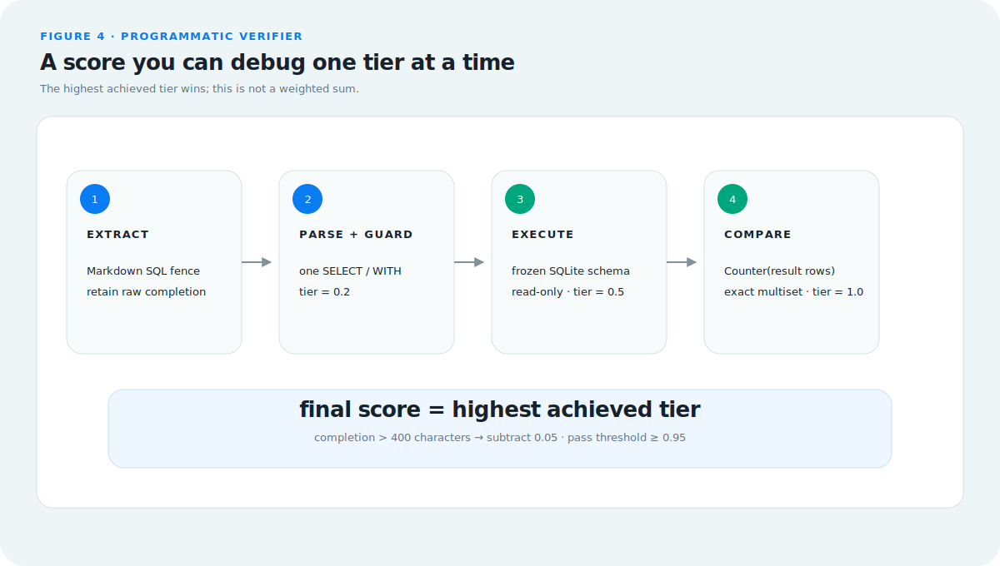
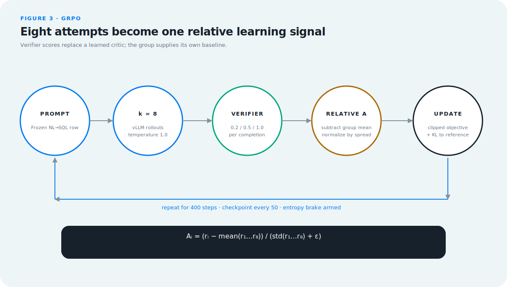
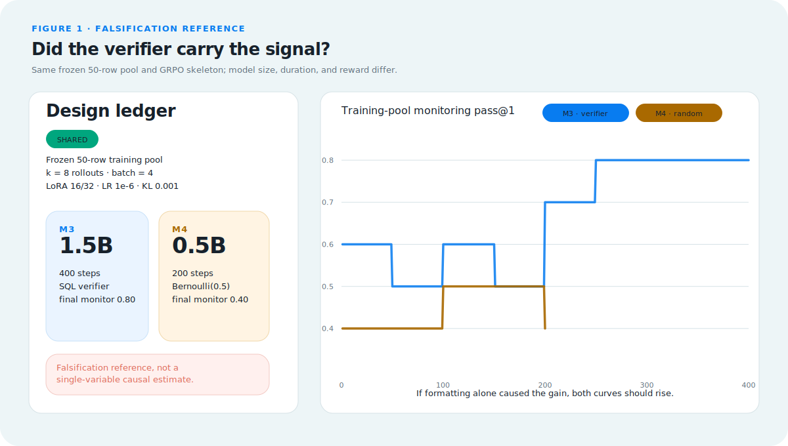
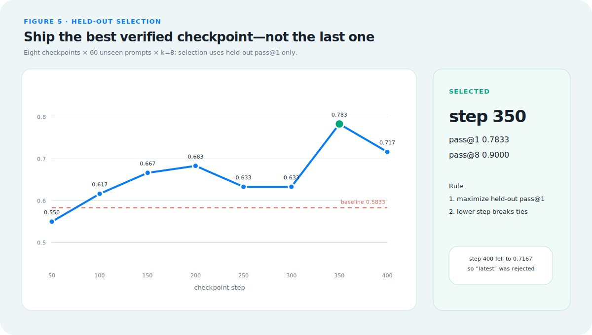
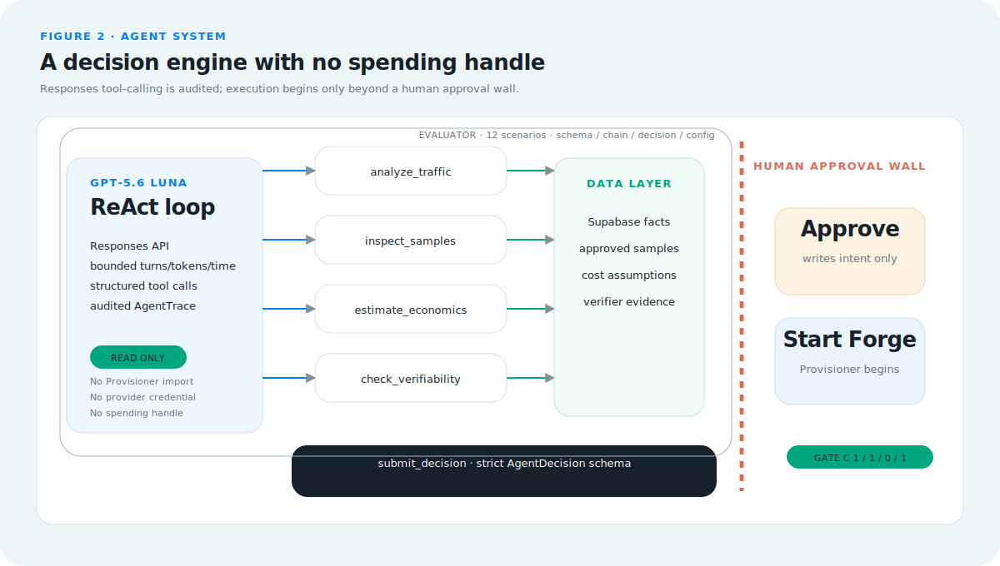

# VerifierForge: turning repetitive LLM spend into a verifiable small-model loop

Large-model bills often hide a useful asymmetry: a small number of repetitive,
high-volume tasks account for a meaningful share of cost, while their outputs
can be checked by a program. VerifierForge turns that combination into an
engineering loop. It discovers a candidate workload, asks an audited Agent
whether specialization is defensible, trains a small open model against a
programmatic verifier, selects a checkpoint on unseen data, and serves it
behind a reversible canary. The claim is deliberately narrow: if success can
be measured reliably, specialization can be tested with evidence instead of
trusted by intuition.

## The six-step loop

*Figure 1. The Agent decides, Supabase remembers, and the Provisioner rents and
returns compute; no GPU node is ever a source of truth.*

The v1 product is three systems that meet at explicit contracts:

1. **Forge Agent** reads traffic, samples, economics, and verifiability. It may
   recommend `forge`, `skip`, or `need_more_data`, but it cannot provision.
2. **Supabase and S3** divide state by shape. Supabase owns relational facts—
   clusters, decisions, approvals, routes, and serving state. S3 owns immutable
   traces, checkpoints, curves, and evidence manifests.
3. **Provisioner** converts a separately approved configuration into a bounded
   provider lifecycle: select capacity, create, bootstrap, run, collect, and
   terminate.

That separation is the safety model. `Approve & Forge` writes durable human
intent. A second explicit `Start Forge` crosses the spending boundary. Serving
has another lifecycle—`cold → provisioning → loading → ready → draining →
cold`—and the report remains readable while inference is cold.

## Fifty seeds, a difficulty gate, and a frozen exam

The data path began with 50 reviewed NL→SQL seeds. The augmentation run asked
for six variants per seed: 300 requested slots produced 276 independently
verified candidates at score `1.0`, a 92% accepted yield. The later difficulty
population combined those 276 variants with the 50 original seeds for 326
records. A deterministic projection selected one solvable but first-attempt-
difficult record per seed, then split the result into a 50-row training pool
and a disjoint 60-row held-out set.

Gate A asked the base evaluator for `k=8` completions per training prompt. The
frozen pool passed all three predeclared predicates:

- pass@1 `0.28`, inside `[0.20, 0.60]`;
- pass@8 `0.88`, at least `0.85`;
- mixed fraction `0.84`, at least `0.30`.

This matters because RL needs both signal and headroom. If every rollout fails,
the group cannot distinguish a better action. If every rollout passes, there is
nothing left to learn. The training pool, held-out set, and verifier v2 were
then bound by the annotated tag `v0.10.2-p0-three-piece-freeze`.

The augmentation client was OpenAI-compatible and configured for OpenRouter;
the repository default is `z-ai/glm-5.2`. The historical augmentation log did
not preserve the resolved model slug, so we do **not** represent that default
as independently observed runtime evidence. Gate A is separately evidenced: it
ran against pod-local vLLM serving `Qwen2.5-1.5B-Instruct`, with no external
completion spend.

Sources: [augmentation and Gate A run sheet](../p0-run-sheet.md),
[training-pool Gate A evidence](../../runs/p0-gate-a/v0.10.1-e2-training-evidence.json),
and [three-piece freeze manifest](../../data/nl2sql/v0.10.2-u3-freeze-manifest.json).

## A verifier that fails in useful layers

*Figure 2. A completion earns the highest tier it reaches—parse `0.2`, execute
`0.5`, exact result multiset `1.0`—so a failure says where the model stopped.*

The verifier first retains the raw completion and extracts SQL from a Markdown
fence. It then requires exactly one read-only `SELECT` or `WITH`, executes it
against the frozen in-memory SQLite schema, and compares the returned row
multiset with the expected rows. SQLite's authorizer is the execution-time
backstop against writes and schema mutation.

This is a **tier ladder**, not a weighted sum. Parseability alone scores `0.2`;
successful execution scores `0.5`; an exact result match scores `1.0`. A
completion longer than 400 characters loses `0.05`, so concise exact SQL still
passes the training accuracy threshold at `0.95`. Each sample record preserves
parser, read-only, execution, result-match, extraction, and penalty facts. When
a group fails, we can distinguish syntax/format, runtime/schema, and semantic
result errors rather than compressing all three into “bad answer.”

Source: [`core/rewards/nl2sql.py`](../../core/rewards/nl2sql.py).

## GRPO with executable rewards

*Figure 3. Eight completions share a group baseline; the verifier supplies the
outcome reward and GRPO updates the policy without a learned critic.*

VerifierForge runs GRPO through `verl`. For each prompt, vLLM samples `G=8`
completions. The verifier scores each completion, and the group-relative
advantage normalizes each reward against its peers:

$$
\hat{A}_i = \frac{r_i - \operatorname{mean}(r_1,\ldots,r_G)}
{\operatorname{std}(r_1,\ldots,r_G)+\epsilon}.
$$

A compact form of the clipped objective is:

$$
J_{\mathrm{GRPO}}(\theta)=
\mathbb{E}\!\left[\frac{1}{G}\sum_{i=1}^{G}
\min\!\left(\rho_i\hat{A}_i,
\operatorname{clip}(\rho_i,1-\varepsilon,1+\varepsilon)\hat{A}_i\right)
-\beta D_{\mathrm{KL}}(\pi_\theta\Vert\pi_{\mathrm{ref}})\right].
$$

Here, `rᵢ` is the programmatic verifier score, `ρᵢ` is the new-to-old policy
ratio, `ε` is the clipping radius, and `β` weights the reference-policy KL
penalty. The shipped run used Qwen2.5-1.5B-Instruct, 400 steps, LoRA rank 16 /
alpha 32, learning rate `1e-6`, KL coefficient `0.001`, and checkpoints every
50 steps. An entropy brake was armed to stop collapse; it did not trigger.

GRPO builds on
[DeepSeekMath](https://arxiv.org/abs/2402.03300). The small-data direction was
inspired by
[Reinforcement Learning for Reasoning in Large Language Models with One Training Example](https://arxiv.org/abs/2504.20571),
and the broader discussion of emergent self-correction was informed by
[DeepSeek-R1](https://arxiv.org/abs/2501.12948). We do not claim a new RL
algorithm or an “aha moment” in this run. The engineering contribution is the
data gate, executable reward, control run, held-out selection, durable evidence,
and disposable-compute delivery around those ideas.

Source: [main GRPO configuration](../../trainer/verl_configs/grpo_v1_1p5b_h100_main.yaml).

## The random-reward falsification reference

*Figure 4. If the apparent gain were only a generic formatting effect, the
random-reward path should also rise; it instead ended at `0.40`.*

The main run used the SQL verifier. A serial control replaced it with a
deterministic `Bernoulli(0.5)` reward derived from immutable input hashes. Both
used the frozen 50-row pool, `k=8`, batch size 4, LoRA 16/32, learning rate
`1e-6`, and KL `0.001`. The main training-pool monitor ended at `0.80`; the
random-reward monitor ended at `0.40`.

This is a falsification reference, not a clean causal estimate. The main run is
1.5B for 400 steps, while the control is 0.5B for 200 steps. We therefore do
not say reward was the only changed variable, and we do not use either
training-pool curve as the quality claim. The actual claim comes from the
frozen held-out exam below.

Sources: [M3 metrics](../../data/demo-artifacts/jobs/d4-m3-1p5b-r1-v0125/metrics.jsonl),
[M4 metrics](../../data/demo-artifacts/jobs/d4-m4-0p5b-random-v0126/metrics.jsonl),
and [random-control configuration](../../trainer/verl_configs/grpo_v1_0p5b_random_control.yaml).

## Why step 350 shipped instead of step 400

*Figure 5. Every 50-step checkpoint sat the same 60-prompt held-out exam;
step 350 peaked at pass@1 `0.7833`, while the final step fell to `0.7167`.*

All eight checkpoints—50 through 400—were converted to standard bf16
Hugging Face directories, loaded one at a time in vLLM, and evaluated on 60
prompts never used for training. Each prompt received eight samples with full
completion and tier evidence. Selection was mechanical: maximize held-out
pass@1, then choose the lower step on a tie.

The baseline was pass@1 `0.5833`; step 350 reached `0.7833` and pass@8 `0.9000`.
Step 400 had a higher pass@8 (`0.9333`) but lower pass@1 (`0.7167`), so it was
not delivered. “Latest checkpoint” is an operational convenience; “best
checkpoint on frozen unseen data” is an evidence rule.

Source: [eight-checkpoint held-out report](../../data/demo-artifacts/jobs/d4-m3-1p5b-r1-v0125/heldout-report.json).

## The Agent has its own verifier

*Figure 6. The Agent may recommend a forge, but only a validated schema can
leave the loop and only a human approval plus Start Forge can reach compute.*

The production Agent uses GPT-5.6 Luna through the Responses API. Its ReAct
loop can call four read-only, Pydantic-typed tools:
`analyze_traffic`, `inspect_samples`, `estimate_economics`, and
`check_verifiability`. The only accepted terminal is a strict
`submit_decision` object. Invalid actions or configurations are rejected as a
whole; they are never silently repaired.

This decision system is evaluated like the model it recommends training. Gate
C contains 12 forge/skip/need-more-data scenarios plus adversarial attempts to
skip dependencies, invent fields, exceed budget, or bypass the base-model
allowlist. Its four admission metrics are tool/dependency behavior, terminal
decision accuracy, illegal-action count, and config legality. The live result
was `1.0 / 1.0 / 0 / 1.0`; replay evaluation runs in CI without provider cost.

That self-reference is intentional: **if the product thesis is that important
automation needs a verifier, the Agent deciding when to automate must also be
inside a verifier.** The audit receipt exposes observable tool calls, inputs,
outputs, timestamps, token counts, rationale, and validated terminal JSON. It
does not claim to expose private chain-of-thought.

Sources: [Gate C live result](../../runs/forge-agent/gate-c-v0223-round2.json)
and [Agent design](../design/design-02-forge-agent-and-eval.md).

## Engineering a disposable system

### Capacity-aware provisioning

Immediately before allocation, the RunPod adapter queries live inventory and
price, filters the approved `small_ada` candidate list, keeps Blackwell blocked,
and tries offers in price order with bounded fallback. The live proof selected
an RTX 4000 Ada Community offer at `$0.20/hr`, created it, and immediately
verified deletion and zero managed `vf-auto-*` inventory. The selected model,
cloud type, and rate enter the job audit.

Source: [capacity proof](../evidence/provisioner/v0.32.0-capacity-live-pass.json).

### Train first, then verify serving on the same card

Training and serving validation use the GPU sequentially. Checkpoints are
candidate artifacts while the trainer is alive. After training exits, the
selected candidate must load in vLLM and return a real completion before it may
be published as serveable. That rule came from repeated memory collisions when
checkpoint validation competed with the trainer on one card.

### Scale-to-zero inference

The serving registry moves through `cold`, `provisioning`, `loading`, `ready`,
and `draining`. Two live wake cycles selected the same `$0.20/hr` RTX 4000 Ada
class, reached ready in `282.14s` and `266.68s`, served real traffic, and were
reaped back to provider-inventory zero. The first cycle sent 200 requests:
111 default, 89 tuned, no fallback; Guardian added 13 points and ended at
`0.95`.

Source: [scale-to-zero live evidence](../evidence/serving/v0.34.0-sv5-live.json).

### S3 workers and recovery boundaries

S3 uses temporary generations plus a manifest-last commit boundary. A real
roundtrip published 50 ordered metric records and a checkpoint, restored the same
SHA, and kept an interrupted upload invisible. Native checkpoint materializing
and resume also reached step 100. The specifically planned timed “kill at step
60, then resume” node-death drill did **not** complete as designed because a
serving gate stopped that run first; the record must not be upgraded into a
passed node-loss experiment.

Sources: [S3 roundtrip](../../runs/d4-m3-1p5b-r1-v0125/evidence/v0.16.0-s3/real-roundtrip.json)
and [recovery boundary](../infrastructure/v0.16.1-native-checkpoint-recovery.md).

### Supabase migration and digest reconciliation

The SQLite product history was migrated through async SQLAlchemy repositories
and Alembic. The importer froze row counts and a canonical digest for eight
tables, imported them into Supabase, then ran again with zero inserts. An
independent verifier matched every count and digest with
`mismatched_tables=[]`. This is why hybrid data ownership is deliberate rather
than accidental: Postgres holds relational truth; S3/artifacts hold the large,
immutable evidence objects.

Source: [DB-2 run-sheet record](../p0-run-sheet.md).

### File-level identity, not an opaque tree hash

The selected step-350 model was once blocked because two tree-hash algorithms
produced different identities for the same candidate. A functional held-out
arbitration established the model, but the process failure was the real lesson:
a total hash with no file-level decomposition is a lock with no inspectable
key. Every serving manifest now records each file name, byte size, SHA-256, the
canonical tree algorithm, and the total identity. The accepted step-350 tree is
`7bde853af7c82405fd1356de9bad9b6c421de45a45ce747f63ea2f8a27eda658`.

Source: [manifest identity record](../versions/v0.15.x/v0.15.1-manifest-identity.md).

## Numbers at a glance

| Evidence | Result | Boundary |
| --- | ---: | --- |
| Held-out pass@1 | `0.5833 → 0.7833` | 60 unseen prompts; selected step 350 |
| Random-reward control | final `0.40` | training-pool monitor; not held-out quality |
| Guardian live point | `0.95` | 200-request scale-to-zero proof |
| Automated 0.5B forge | estimated `$0.177846` (`$0.18`) | provider estimate, billing unsettled |
| Capacity selection | `$0.20/hr` | live RTX 4000 Ada offer |
| Serving cold start | `282.14s / 266.68s` | two complete wake/reap cycles |
| Gate C | `1.0 / 1.0 / 0 / 1.0` | 12 live scenarios |
| Regression snapshot | `474 passed, 1 skipped` | historical v0.34 closeout, not current count |

The automated forge estimate comes from the fifth P-2 attempt's recorded
provider estimate (`$0.177846`), not a settled invoice. Source:
[P-2 evidence](../evidence/provisioner/v0.28.5-p2-live-pass.json).

## GPT-5.6 and Codex played different roles

GPT-5.6 Luna is a runtime organ: it performs the bounded business decision in
Discover, through strict tool calls and a Gate-C-qualified terminal schema.
The trained Qwen model is the runtime NL→SQL specialist. The augmentation path
used a separately configured OpenRouter-compatible client. These are different
models with different responsibilities.

Codex was the development collaborator across the owner-defined build sprint.
The repository contains 95 mechanically versioned delivery records and 309
commits dated July 14–20. The run sheet shows why that workflow mattered:

- A short H100 observation window was first classified as a hang, then revised
  when a healthy 0.5B baseline showed its first metric could take 13 minutes.
- A hidden `total_epochs` cap ended a nominal 400-step run at 120; the repair
  derived or rejected epoch limits before launch.
- A model-directory tree hash disagreed with its archive identity; the ensuing
  arbitration produced today's per-file manifest rule.

Those are not claims that an agent operated without human governance. The
human set architecture, budgets, gates, stop conditions, and exceptions.
Codex implemented, diagnosed, preserved evidence, and stopped when a declared
gate failed. The run sheet was the handoff boundary between sessions.

Source: [complete operational run sheet](../p0-run-sheet.md).

## Limits and what this result does not prove

- This is one NL→SQL task family, 50 training rows, and 60 held-out rows—not a
  broad language-model benchmark.
- M3/M4 is a useful falsification reference, not a randomized controlled
  experiment, because model size and duration also differ.
- A SQL verifier proves behavior only within its schema, fixtures, extraction,
  and result-comparison semantics.
- The scale-to-zero endpoint uses an ephemeral tunnel and a several-minute cold
  start; static report evidence remains available while it sleeps.
- Gate C covers 12 frozen scenarios. A pass supports this bounded product
  workflow, not autonomous authority over arbitrary workloads.
- The timed S3 node-death drill remains incomplete even though roundtrip and
  checkpoint resume primitives passed.

## References

1. Shao et al., [DeepSeekMath: Pushing the Limits of Mathematical Reasoning in Open Language Models](https://arxiv.org/abs/2402.03300), 2024.
2. Wang et al., [Reinforcement Learning for Reasoning in Large Language Models with One Training Example](https://arxiv.org/abs/2504.20571), 2025.
3. DeepSeek-AI, [DeepSeek-R1: Incentivizing Reasoning Capability in LLMs via Reinforcement Learning](https://arxiv.org/abs/2501.12948), 2025.
